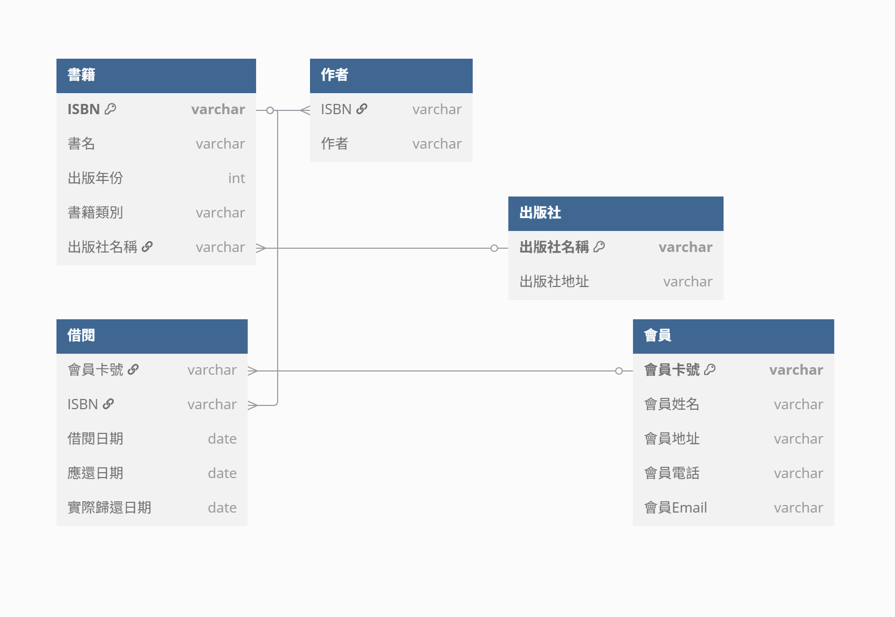

# Lab-05_1
## 1.
### **重複問題**
+ 許多書可能來自同一位作者，一本書可能由多位作者撰寫
+ 同一出版社出版多本書時可能會出現許多重複的出版社名稱以及地址
+ 同一本書可能會有許多的書籍類別
+ 如果會員多次借閱書籍，會員資料會重複出現在借閱資料中
+ 會員姓名、書名在借閱資料中是多餘的，因為可以使用會員卡與IBSN查詢到  

**插入異常:**
+ 不能先加入出版社資訊，除非他們有出版過一本書
+ 無法記錄沒有借閱過書籍的會員資訊，以及未被借出的書籍資訊  

**更新異常:**
+ 如出版社需要修改地址，所有由該出版社出版的書籍都需要修改地址，否則會造成資料不一致
+ 如會員修改會員姓名，所有在借閱資料中的會員資料皆需要修改，否則會發生不同書由同一個會員卡號借閱但姓名不同
+ 如某一本書書名更改，則該書的借閱資料皆需要修改  

**刪除異常:**
+ 刪除改出版社唯一出版的一本書也會直接刪除該出版社資料
+ 如刪除會員借閱的資料可能會刪除其會員資料
+ 如刪除某本書籍的其中一本資料可能也會刪除其書籍資料  

### **函數相依**  
+ 書籍
    + `ISBN` --> `書名`、`作者(可能多位)`、`出版社名稱`、`出版社地址`、`出版年份`、`書籍類別`
    + `出版社名稱` --> `出版社地址`  

+ 會員
    + `會員卡號` --> `會員姓名`、`會員地址`、`會員電話`、`會員Email`  

+ 借閱
    + `會員卡號` --> `會員姓名`
    + `ISBN` --> `書名`
    + `會員卡號`、`IBSN`、`借閱日期` --> `應還日期`、`實際歸還日期 `

2:  

### 原始表格
| ISBN | 書名 | 作者 (可能多位) | 出版社名稱 | 出版社地址 | 出版年份 | 書籍類別 | 會員卡號 | 會員姓名 | 會員地址 | 會員電話 | 會員Email | 借閱日期 | 應還日期 | 實際歸還日期 |
|---|---|---|---|---|---|---|---|---|---|---|---|---|---|---|
| 978-7-121-12345-6 | 程式設計入門 | 王小明, 陳大中 | 科技出版社 | 台北市信義區忠孝東路1號 | 2020 | 電腦科學 | M001 | 李美玲 | 台北市大安區和平東路10號 | 0912345678 | meiling@email.com | 2024-01-10 | 2024-01-24 | 2024-01-23 |
| 978-7-121-12345-6 | 程式設計入門 | 王小明, 陳大中 | 科技出版社 | 台北市信義區忠孝東路1號 | 2020 | 電腦科學 | M002 | 張志強 | 新北市板橋區文化路20號 | 0928765432 | zhiqiang@email.com | 2024-02-01 | 2024-02-15 | NULL |
| 978-7-121-98765-4 | 經濟學原理 | 林教授 | 商業書局 | 高雄市前金區中華路50號 | 2018 | 社會科學 | M001 | 李美玲 | 台北市大安區和平東路10號 | 0912345678 | meiling@email.com | 2024-01-15 | 2024-01-29 | 2024-01-28 |
| 978-9-865-43210-9 | 寂寞的十七歲 | 吳婉君 | 文學出版社 | 台中市西區公益路88號 | 1999 | 文學 | M003 | 林雅婷 | 台中市北區學士路30號 | 0933445566 | yating@email.com | 2024-02-05 | 2024-02-19 | NULL |

## 第一正規化

### 說明
+ 將重複表格拉出

| ISBN | 書名 | 作者 (可能多位) | 出版社名稱 | 出版社地址 | 出版年份 | 書籍類別 | 會員卡號 | 會員姓名 | 會員地址 | 會員電話 | 會員Email | 借閱日期 | 應還日期 | 實際歸還日期 |
|---|---|---|---|---|---|---|---|---|---|---|---|---|---|---|
| 978-7-121-12345-6 | 程式設計入門 | 王小明 | 科技出版社 | 台北市信義區忠孝東路1號 | 2020 | 電腦科學 | M001 | 李美玲 | 台北市大安區和平東路10號 | 0912345678 | meiling@email.com | 2024-01-10 | 2024-01-24 | 2024-01-23 |
| 978-7-121-12345-6 | 程式設計入門 | 陳大中 | 科技出版社 | 台北市信義區忠孝東路1號 | 2020 | 電腦科學 | M001 | 李美玲 | 台北市大安區和平東路10號 | 0912345678 | meiling@email.com | 2024-01-10 | 2024-01-24 | 2024-01-23 |
| 978-7-121-12345-6 | 程式設計入門 | 王小明 | 科技出版社 | 台北市信義區忠孝東路1號 | 2020 | 電腦科學 | M002 | 張志強 | 新北市板橋區文化路20號 | 0928765432 | zhiqiang@email.com | 2024-02-01 | 2024-02-15 | NULL |
| 978-7-121-12345-6 | 程式設計入門 | 陳大中 | 科技出版社 | 台北市信義區忠孝東路1號 | 2020 | 電腦科學 | M002 | 張志強 | 新北市板橋區文化路20號 | 0928765432 | zhiqiang@email.com | 2024-02-01 | 2024-02-15 | NULL |
| 978-7-121-98765-4 | 經濟學原理 | 林教授 | 商業書局 | 高雄市前金區中華路50號 | 2018 | 社會科學 | M001 | 李美玲 | 台北市大安區和平東路10號 | 0912345678 | meiling@email.com | 2024-01-15 | 2024-01-29 | 2024-01-28 |
| 978-9-865-43210-9 | 寂寞的十七歲 | 吳婉君 | 文學出版社 | 台中市西區公益路88號 | 1999 | 文學 | M003 | 林雅婷 | 台中市北區學士路30號 | 0933445566 | yating@email.com | 2024-02-05 | 2024-02-19 | NULL |

## 第二正規化

### 說明
+ 將表格拆分為多個子表，消除部分函數相依，確保每個非主鍵屬性完全依賴於主鍵。

#### ISBN
| ISBN | 書名 | 出版年份 | 書籍類別 | 出版社名稱 |
|---|---|---|---|---|
| 978-7-121-12345-6 | 程式設計入門 | 2020 | 電腦科學 | 科技出版社 |
| 978-7-121-98765-4 | 經濟學原理 | 2018 | 社會科學 | 商業書局 |
| 978-9-865-43210-9 | 寂寞的十七歲 | 1999 | 文學 | 文學出版社 |

#### 作者
| ISBN | 作者 |
|---|---|
| 978-7-121-12345-6 | 王小明 |
| 978-7-121-12345-6 | 陳大中 |
| 978-7-121-98765-4 | 林教授 |
| 978-9-865-43210-9 | 吳婉君 |

#### 出版社
| 出版社名稱 | 出版社地址 |
|---|---|
| 科技出版社 | 台北市信義區忠孝東路1號 |
| 商業書局 | 高雄市前金區中華路50號 |
| 文學出版社 | 台中市西區公益路88號 |

#### 會員
| 會員卡號 | 會員姓名 | 會員地址 | 會員電話 | 會員Email |
|---|---|---|---|---|
| M001 | 李美玲 | 台北市大安區和平東路10號 | 0912345678 | meiling@email.com |
| M002 | 張志強 | 新北市板橋區文化路20號 | 0928765432 | zhiqiang@email.com |
| M003 | 林雅婷 | 台中市北區學士路30號 | 0933445566 | yating@email.com |

#### 借閱
| 會員卡號 | ISBN | 借閱日期 | 應還日期 | 實際歸還日期 |
|---|---|---|---|---|
| M001 | 978-7-121-12345-6 | 2024-01-10 | 2024-01-24 | 2024-01-23 |
| M002 | 978-7-121-12345-6 | 2024-02-01 | 2024-02-15 | NULL |
| M001 | 978-7-121-98765-4 | 2024-01-15 | 2024-01-29 | 2024-01-28 |
| M003 | 978-9-865-43210-9 | 2024-02-05 | 2024-02-19 | NULL |

## 第三正規化

### 說明
+ 消除傳遞函數相依，確保每個非主鍵屬性直接依賴於主鍵。

### 表格拆分

#### 書籍表 (Books)
| ISBN | 書名 | 出版年份 | 書籍類別 | 出版社名稱 |
|---|---|---|---|---|
| 978-7-121-12345-6 | 程式設計入門 | 2020 | 電腦科學 | 科技出版社 |
| 978-7-121-98765-4 | 經濟學原理 | 2018 | 社會科學 | 商業書局 |
| 978-9-865-43210-9 | 寂寞的十七歲 | 1999 | 文學 | 文學出版社 |

#### 作者
| ISBN | 作者 |
|---|---|
| 978-7-121-12345-6 | 王小明 |
| 978-7-121-12345-6 | 陳大中 |
| 978-7-121-98765-4 | 林教授 |
| 978-9-865-43210-9 | 吳婉君 |

#### 出版社
| 出版社名稱 | 出版社地址 |
|---|---|
| 科技出版社 | 台北市信義區忠孝東路1號 |
| 商業書局 | 高雄市前金區中華路50號 |
| 文學出版社 | 台中市西區公益路88號 |

#### 會員
| 會員卡號 | 會員姓名 | 會員地址 | 會員電話 | 會員Email |
|---|---|---|---|---|
| M001 | 李美玲 | 台北市大安區和平東路10號 | 0912345678 | meiling@email.com |
| M002 | 張志強 | 新北市板橋區文化路20號 | 0928765432 | zhiqiang@email.com |
| M003 | 林雅婷 | 台中市北區學士路30號 | 0933445566 | yating@email.com |

#### 借閱
| 會員卡號 | ISBN | 借閱日期 | 應還日期 | 實際歸還日期 |
|---|---|---|---|---|
| M001 | 978-7-121-12345-6 | 2024-01-10 | 2024-01-24 | 2024-01-23 |
| M002 | 978-7-121-12345-6 | 2024-02-01 | 2024-02-15 | NULL |
| M001 | 978-7-121-98765-4 | 2024-01-15 | 2024-01-29 | 2024-01-28 |
| M003 | 978-9-865-43210-9 | 2024-02-05 | 2024-02-19 | NULL |

## ERD

