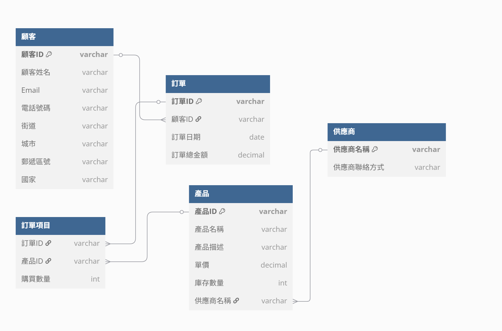

# Lab-05_2

### 單一扁平化表格 
| 顧客ID | 顧客姓名 | Email | 電話號碼 | 街道 | 城市 | 郵遞區號 | 國家 | 產品ID | 產品名稱 | 產品描述 | 單價 (產品) | 庫存數量 | 供應商名稱 | 供應商聯絡方式 | 訂單ID | 訂單日期 | 訂單總金額 | 購買數量 |
|---|---|---|---|---|---|---|---|---|---|---|---|---|---|---|---|---|---|---|
| C001 | 王小明 | david@email.com | 0912345678 | 忠孝東路1號 | 台北市 | 100 | 台灣 | P101、P102 | 智慧型手機、無線耳機 | 旗艦機種、重低音 | 25000、1500 | 100、50 | XYZ科技、ABC音響 | xyz@contact.com、abc@contact.com | O001 | 2023-05-10 | 25500 | 1 |
| C002 | 陳美玲 | chen@email.com | 0933445566 | 中山路20號 | 高雄市 | 800 | 台灣 | P101 | 智慧型手機 | 旗艦機種 | 25000 | 100 | XYZ科技 | xyz@contact.com | O002 | 2023-05-12 | 25000 | 1 |
| C003 | 林志豪 | lin@email.com | 0987654321 | 復興北路50號 | 台中市 | 400 | 台灣 | P103 | 藍芽鍵盤 | 超薄設計 | 800 | 200 | XYZ科技 | xyz@contact.com | O003 | 2023-05-15 | 800 | 1 |

### 函數相依

+ 顧客

    + `顧客ID` > `顧客姓名`、`Email`、`電話號碼`、`街道`、`城市`、`郵遞區號`、`國家`  

+ 產品

    + `產品ID` > `產品名稱`、`產品描述`、`單價`、`庫存數量`
    + `供應商名稱` > `供應商聯絡方式`

+ 訂單

    + `訂單ID` > `顧客ID`、`訂單日期`、`訂單總金額`
    + `訂單ID`、`產品ID` > `購買數量`

## 第一正規化  

| 顧客ID | 顧客姓名 | Email | 電話號碼 | 街道 | 城市 | 郵遞區號 | 國家 | 產品ID | 產品名稱 | 產品描述 | 單價 (產品) | 庫存數量 | 供應商名稱 | 供應商聯絡方式 | 訂單ID | 訂單日期 | 訂單總金額 | 購買數量 |
|---|---|---|---|---|---|---|---|---|---|---|---|---|---|---|---|---|---|---|
| C001 | 王小明 | david@email.com | 0912345678 | 忠孝東路1號 | 台北市 | 100 | 台灣 | P101 | 智慧型手機 | 旗艦機種 | 25000 | 100 | XYZ科技 | xyz@contact.com | O001 | 2023-05-10 | 25500 | 1 |
| C001 | 王小明 | david@email.com | 0912345678 | 忠孝東路1號 | 台北市 | 100 | 台灣 | P102 | 無線耳機 | 重低音 | 1500 | 50 | ABC音響 | abc@contact.com | O001 | 2023-05-10 | 25500 | 1 |
| C002 | 陳美玲 | chen@email.com | 0933445566 | 中山路20號 | 高雄市 | 800 | 台灣 | P101 | 智慧型手機 | 旗艦機種 | 25000 | 100 | XYZ科技 | xyz@contact.com | O002 | 2023-05-12 | 25000 | 1 |
| C003 | 林志豪 | lin@email.com | 0987654321 | 復興北路50號 | 台中市 | 400 | 台灣 | P103 | 藍芽鍵盤 | 超薄設計 | 800 | 200 | XYZ科技 | xyz@contact.com | O003 | 2023-05-15 | 800 | 1 |

### 說明
+ 將訂單改為每筆為一行，消除多值欄位

## 第二正規化

### 說明
+ 依據部分函數相依，將表格拆分為顧客、產品、供應商、訂單、訂單項目

### 顧客
| <u>顧客ID</u> | 顧客姓名 | Email | 電話號碼 | 街道 | 城市 | 郵遞區號 | 國家 |
|---|---|---|---|---|---|---|---|
| C001 | 王小明 | david@email.com | 0912345678 | 忠孝東路1號 | 台北市 | 100 | 台灣 |
| C002 | 陳美玲 | chen@email.com | 0933445566 | 中山路20號 | 高雄市 | 800 | 台灣 |
| C003 | 林志豪 | lin@email.com | 0987654321 | 復興北路50號 | 台中市 | 400 | 台灣 |  

### 產品
| <u>產品ID</u> | 產品名稱 | 產品描述 | 單價 (產品) | 庫存數量 | 供應商 |
| --- | --- | --- | --- | --- | --- |
| P101 | 智慧型手機 | 旗艦機種 | 25000 | 100 | XYZ科技 |
| P102 | 無線耳機 | 重低音 | 1500 | 50 | ABC音響 |
| P103 | 藍芽鍵盤 | 超薄設計 | 800 | 200 | XYZ科技 |

### 供應商
| <u>供應商名稱</u> | 供應商聯絡方式 |
| --- | --- |
| XYZ科技 | xyz@contact.com |
| ABC音響 | abc@contact.com |

### 訂單
| <U>訂單ID</u> | <u>顧客ID</u> | 訂單日期 | 訂單總金額 |
| --- | --- | --- | --- |
| O001 | C001 | 2023-05-10 | 25500 |
| O002 | C002 | 2023-05-12 | 25000 |
| O003 | C003 | 2023-05-15 | 800 |
| O004 | C001 | 2023-05-18 | 1500 |

### 訂單項目
| <u>訂單ID</u> | <u>產品ID</u> | 購買數量 |
|---|---|---|
| O001 | P101 | 1 |
| O001 | P102 | 1 |
| O002 | P101 | 1 |
| O003 | P103 | 1 |
| O004 | P103 | 1 |
| O004 | P102 | 1 |

## 第三正規化

### 說明
+ 檢查使否有遞移相依
+ 均符合3NF

## ERD

