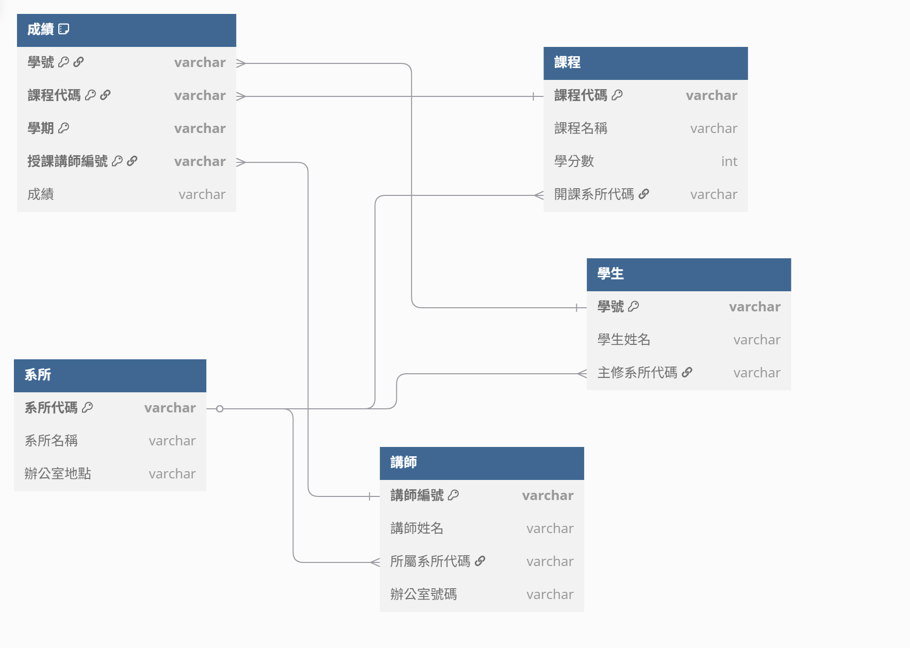

# Lab-05_3
### 函數相依
+ 學生
    + `學號` --> `學生姓名`、`主修科系名稱`、`主修科系辦公室地點`
    + `主修科系名稱` --> `主修科系辦公室地點`
+ 課程
    + `課程代碼` --> `課程名稱`、`學分數`、`開課系所代碼`、`開課系所名稱`
    + `開課系所代碼` --> `開課系所名稱`
    + `講師編號` --> `講師姓名`、`講師所屬系所代碼`、`講師所屬系所名稱`、`講師辦公室號碼`
    + `講師所屬系所代碼` --> `講師所屬系所名稱`
    + `學號`、`課程代碼`、`學期`、`授課講師編號` --> `成績`

## 原始資料
| 學號 | 學生姓名 | 主修科系名稱 | 主修科系辦公室地點 | 課程代碼 | 課程名稱 | 學分數 | 開課系所代碼 | 開課系所名稱 | 講師編號 | 講師姓名 | 講師所屬系所代碼 | 講師所屬系所名稱 | 講師辦公室號碼 | 學期 | 成績 |
|---|---|---|---|---|---|---|---|---|---|---|---|---|---|---|---|
| S001 | 王大明 | 資訊工程 | 電資大樓301 | CS101 | 程式設計 | 3 | CS | 資訊工程學系 | T001 | 李老師 | CS | 資訊工程學系 | 電資大樓401 | 2024-1 | A |
| S001 | 王大明 | 資訊工程 | 電資大樓301 | MA101 | 微積分 | 3 | MA | 數學系 | T003 | 趙老師 | MA | 數學系 | 理學大樓203 | 2024-1 | B+ |
| S002 | 陳小美 | 歷史 | 文學院205 | HS201 | 世界歷史 | 3 | HS | 歷史學系 | T002 | 張老師 | HS | 歷史學系 | 文學院310 | 2024-1 | A- |
| S002 | 陳小美 | 歷史 | 文學院205 | CS101 | 程式設計 | 3 | CS | 資訊工程學系 | T001 | 李老師 | CS | 資訊工程學系 | 電資大樓401 | 2024-2 | B |
| S003 | 林志玲 | 資訊工程 | 電資大樓301 | CS101 | 程式設計 | 3 | CS | 資訊工程學系 | T004 | 王老師 | CS | 資訊工程學系 | 電資大樓405 | 2024-1 | B+ |

## 第一正規化

### 說明
+ 所有資料皆為原子值，且無重複群駔

## 第二正規化

### 說明
+ 將部分依賴從表格中分開，拆分為學號、課程代碼、講師編號、成績

### 學號

| <u>學號</u> | 學生姓名 | 主修科系名稱 | 主修科系辦公室地點 |
|---|---|---|---|
| S001 | 王大明 | 資訊工程 | 電資大樓301 |
| S002 | 陳小美 | 歷史 | 文學院205 |
| S003 | 林志玲 | 資訊工程 | 電資大樓301 |

### 課程代碼

| <u>課程代碼</u> | 課程名稱 | 學分數 | 開課系所代碼 | 開課系所名稱 |
|---|---|---|---|---|
| CS101 | 程式設計 | 3 | CS | 資訊工程學系 |
| MA101 | 微積分 | 3 | MA | 數學系 |
| HS201 | 世界歷史 | 3 | HS | 歷史學系 |

### 講師編號

| <u>講師編號</u> | 講師姓名 | 講師所屬系所代碼 | 講師所屬系所名稱 | 講師辦公室號碼 |
|---|---|---|---|---|
| T001 | 李老師 | CS | 資訊工程學系 | 電資大樓401 |
| T003 | 趙老師 | MA | 數學系 | 理學大樓203 |
| T002 | 張老師 | HS | 歷史學系 | 文學院310 |
| T004 | 王老師 | CS | 資訊工程學系 | 電資大樓405 |

### 成績

| <u>學號</u> | <u>課程代碼</u> | <u>學期</u> | <u>授課講師編號</u> | <u>成績</u> |
|---|---|---|---|---|
| S001 | CS101 | 2024-1 | T001 | A |
| S001 | MA101 | 2024-1 | T003 | B+ |
| S002 | HS201 | 2024-1 | T002 | A- |
| S002 | CS101 | 2024-2 | T001 | B |
| S003 | CS101 | 2024-1 | T004 | B+ |

## 第三正規化

### 說明
+ 消除遞移相依，建立系所資料表
+ 學生資料表加入系所代號

### 系所

| <u>系所代碼</u> | 系所名稱 | 辦公室地點 |
|---|---|---|
| CS | 資訊工程學系 | 電資大樓301 |
| MA | 數學系 | 理學大樓203 |
| HS | 歷史學系 | 文學院205 |

### 學生

| <u>學號</u> | 學生姓名 | 主修系所代碼 |
|---|---|---|
| S001 | 王大明 | CS |
| S002 | 陳小美 | HS |
| S003 | 林志玲 | CS |

### 課程

| <u>課程代碼</u> | 課程名稱 | 學分數 | 開課系所代碼 |
|---|---|---|---|
| CS101 | 程式設計 | 3 | CS |
| MA101 | 微積分 | 3 | MA |
| HS201 | 世界歷史 | 3 | HS |

### 講師

| <u>講師編號</u> | 講師姓名 | 所屬系所代碼 | 辦公室號碼 |
|---|---|---|---|
| T001 | 李老師 | CS | 電資大樓401 |
| T003 | 趙老師 | MA | 理學大樓203 |
| T002 | 張老師 | HS | 文學院310 |
| T004 | 王老師 | CS | 電資大樓405 |

### 成績

**複合主鑑**

| <u>學號</u> | <u>課程代碼</u> | <u>學期</u> | <u>授課講師編號</u> | 成績 |
|---|---|---|---|---|
| S001 | CS101 | 2024-1 | T001 | A |
| S001 | MA101 | 2024-1 | T003 | B+ |
| S002 | HS201 | 2024-1 | T002 | A- |
| S002 | CS101 | 2024-2 | T001 | B |
| S003 | CS101 | 2024-1 | T004 | B+ |

## BCNF

3NF已完成BCNF所要求，所有表格決定因素均為候選鍵，並且無須退回3NF，因為3NF 設計自然的滿足了BCNF的要求，沒有引入過多的分解。主要是因為初始假設(一門課程可有多位講師，學生選修特定學期的特定課程，由特定講師授課)讓成績的複合主鍵沒有違反BCNF

## ERD

